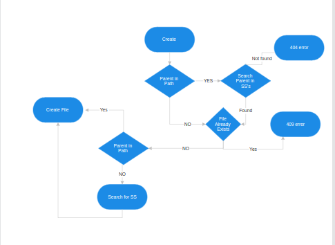

# Network File System (NFS)

### Team Members 
    - Ayan Datta 
    - Suyash Sethia
    - Aditya Raghuvanshi

### Functionality

1. Create
- File and Folder 

Client Side (Aditya)
- Send Create Request with file / Folder Path 
- recieve response from NM

NM Side (Ayan )

- Recieve Create Request from Client
- For create file, send CREATE request to SS 
- If successfull CREATE_BACKUP request to two other SS
- send response 200 to client

SS Side (Suyash)
- Recieve CREATE request from NM
- Create file in correct Path inside Root 
- Send response 200 to NM if successfull
- else send response 500 to NM if unsuccessfull

### SS file Structure 
SS
- SS_Root_0 
    - Files / Folders 
- SS_Root_1 
    - Files / Folders 

## Format 
## Request and response format
- Every request is proceeded by a header
### Header Format
- Request/Response Type - 1 byte (char)
- Payload Length - 8 bytes (uint64_t)

- After the request, payload follows, whose length is defined by the header.

Eg Create a.txt -> 
Header(type='C', length=5)
Payload("a.txt")

- Include Headers from Common for functions for sending and receiving commands
